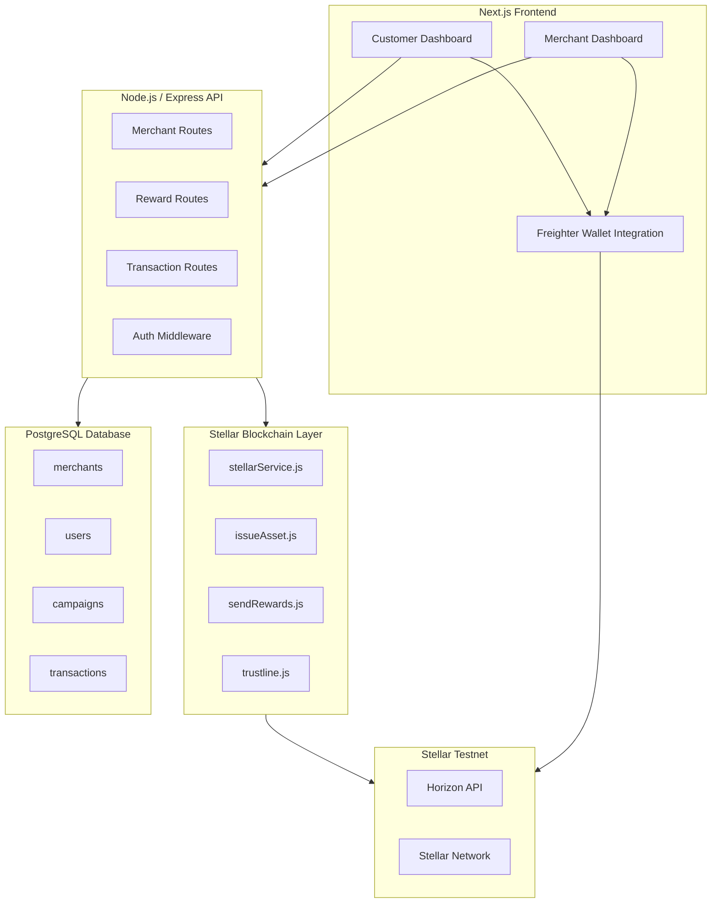

# Design Document: NovaRewards

## Overview

NovaRewards is a decentralized loyalty rewards platform built on the Stellar blockchain. Merchants issue NOVA tokens to customers for purchases or engagement. Customers hold, transfer, and redeem these tokens across participating merchants. The platform is composed of four layers: a Next.js frontend, a Node.js/Express backend API, a PostgreSQL database, and a Stellar blockchain service layer.

All blockchain interactions on the Stellar Testnet use the official `stellar-sdk` npm package. Customer-facing transactions (trustline creation, redemptions, peer-to-peer transfers) are signed client-side via the `@stellar/freighter-api` browser extension. Server-side transactions (reward distribution) are signed using the Distribution Account secret key stored in environment variables.

---

## Architecture



---

## Components and Interfaces

### Frontend (Next.js)

**Pages:**
- `/` — Landing page with wallet connect CTA
- `/dashboard` — Customer dashboard (balance, history, transfer, redeem)
- `/merchant` — Merchant dashboard (campaigns, issue rewards)

**Key Modules:**
- `lib/freighter.js` — Wrapper around `@stellar/freighter-api` for connect, getPublicKey, signTransaction
- `lib/horizonClient.js` — Wrapper around Horizon REST API for balance and transaction queries
- `lib/api.js` — Axios client for backend API calls

**Freighter Integration Flow:**
```
isConnected() → requestAccess() → getPublicKey() → [store in React state/context]
```
For signing: build unsigned XDR on backend or frontend → `signTransaction(xdr, { networkPassphrase })` → submit signed XDR to Horizon.

### Backend (Node.js / Express)

**Route Groups:**

| Prefix | Purpose |
|---|---|
| `POST /api/merchants/register` | Register a new merchant |
| `POST /api/campaigns` | Create a reward campaign |
| `GET /api/campaigns/:merchantId` | List campaigns for a merchant |
| `POST /api/rewards/distribute` | Distribute NOVA tokens to a customer |
| `GET /api/transactions/:walletAddress` | Get transaction history for a wallet |
| `POST /api/trustline/verify` | Check if a wallet has a NOVA trustline |

**Middleware:**
- `validateEnv` — Checks all required env vars on startup
- `merchantAuth` — Validates merchant API key on protected routes

### Blockchain Layer (`blockchain/`)

| File | Responsibility |
|---|---|
| `stellarService.js` | Shared Horizon server instance, asset definition, helper utilities |
| `issueAsset.js` | One-time script: fund accounts, establish distribution trustline, issue initial NOVA supply |
| `sendRewards.js` | Build and submit a payment from Distribution Account to customer wallet |
| `trustline.js` | Build unsigned changeTrust XDR for client-side signing; verify trustline existence |

---

## Data Models

### PostgreSQL Schema

```sql
-- Merchants
CREATE TABLE merchants (
  id          SERIAL PRIMARY KEY,
  name        VARCHAR(255) NOT NULL,
  wallet_address VARCHAR(56) NOT NULL UNIQUE,
  business_category VARCHAR(100),
  api_key     VARCHAR(64) NOT NULL UNIQUE,
  created_at  TIMESTAMPTZ DEFAULT NOW()
);

-- Users (lightweight — wallet address is the primary identity)
CREATE TABLE users (
  id          SERIAL PRIMARY KEY,
  wallet_address VARCHAR(56) NOT NULL UNIQUE,
  created_at  TIMESTAMPTZ DEFAULT NOW()
);

-- Reward Campaigns
CREATE TABLE campaigns (
  id          SERIAL PRIMARY KEY,
  merchant_id INTEGER REFERENCES merchants(id) ON DELETE CASCADE,
  name        VARCHAR(255) NOT NULL,
  reward_rate NUMERIC(18, 7) NOT NULL CHECK (reward_rate > 0),
  start_date  DATE NOT NULL,
  end_date    DATE NOT NULL CHECK (end_date > start_date),
  is_active   BOOLEAN DEFAULT TRUE,
  created_at  TIMESTAMPTZ DEFAULT NOW()
);

-- Transactions
CREATE TABLE transactions (
  id              SERIAL PRIMARY KEY,
  tx_hash         VARCHAR(64) UNIQUE,
  tx_type         VARCHAR(20) NOT NULL CHECK (tx_type IN ('distribution','redemption','transfer')),
  amount          NUMERIC(18, 7) NOT NULL,
  from_wallet     VARCHAR(56),
  to_wallet       VARCHAR(56),
  merchant_id     INTEGER REFERENCES merchants(id),
  campaign_id     INTEGER REFERENCES campaigns(id),
  stellar_ledger  INTEGER,
  created_at      TIMESTAMPTZ DEFAULT NOW()
);
```

### Key Data Flows

**Reward Distribution:**
```
Merchant Dashboard → POST /api/rewards/distribute
  → validate merchant + campaign (DB)
  → verify customer trustline (Horizon)
  → sendRewards.js builds + signs + submits payment tx
  → record tx_hash in transactions table
  → return success + tx_hash to frontend
```

**Trustline Creation (client-side):**
```
Customer Dashboard → trustline.js builds unsigned changeTrust XDR
  → return XDR to frontend
  → Freighter signs XDR
  → frontend submits signed XDR to Horizon
  → frontend confirms trustline via Horizon account query
```

**Redemption:**
```
Customer Dashboard → build unsigned payment XDR (customer → merchant)
  → Freighter signs XDR
  → frontend submits to Horizon
  → POST /api/transactions/record with tx_hash
  → backend verifies tx on Horizon, records in DB
  → apply campaign benefit
```

---

## Correctness Properties

*A property is a characteristic or behavior that should hold true across all valid executions of a system — essentially, a formal statement about what the system should do. Properties serve as the bridge between human-readable specifications and machine-verifiable correctness guarantees.*

### Property-Based Testing Overview

Property-based testing (PBT) validates software correctness by testing universal properties across many generated inputs. Each property is a formal specification that should hold for all valid inputs. The testing library used is **fast-check** (JavaScript/TypeScript), configured with a minimum of 100 runs per property.

---

Property 1: Reward distribution increases customer balance
*For any* valid customer wallet with an active trustline and any positive NOVA reward amount, after a successful distribution transaction, the customer's NOVA balance should increase by exactly that amount.
**Validates: Requirements 3.3**

---

Property 2: Trustline verification is idempotent
*For any* Stellar wallet address, calling the trustline verification function multiple times in succession should return the same result each time without side effects or errors.
**Validates: Requirements 2.4**

---

Property 3: Campaign validation rejects invalid inputs
*For any* campaign input where the reward rate is zero or negative, or where the end date is not strictly after the start date, the campaign creation function should reject the input and return a validation error.
**Validates: Requirements 7.3**

---

Property 4: Transaction record round-trip
*For any* completed Stellar transaction (distribution, redemption, or transfer), recording it to the database and then querying by tx_hash should return an equivalent transaction record with the same amount, type, from_wallet, and to_wallet.
**Validates: Requirements 3.4, 4.3, 5.4**

---

Property 5: Operations blocked without trustline
*For any* customer wallet address that does not have an active NOVA trustline, both reward distribution and peer-to-peer transfer functions should return an error and not submit a Stellar transaction.
**Validates: Requirements 3.2, 3.6, 5.2, 5.5**

---

Property 6: Stellar public key validation
*For any* string that is not a valid 56-character Stellar public key (starting with 'G'), the wallet address validation function should reject it as invalid.
**Validates: Requirements 5.1**

---

Property 7: Expired campaign blocks distribution
*For any* campaign whose end_date is before the current date, attempting to distribute rewards under that campaign should return an error and not submit a Stellar transaction.
**Validates: Requirements 7.5**

---

Property 8: Insufficient balance rejects operations
*For any* redemption or transfer request where the requested amount exceeds the sender's current NOVA balance, the system should reject the request and return a descriptive error without submitting a Stellar transaction.
**Validates: Requirements 4.1, 4.5, 5.6**

---

Property 9: Merchant transaction queries are scoped
*For any* merchant ID, querying transactions and campaigns from the database should return only records associated with that merchant ID and never records belonging to other merchants.
**Validates: Requirements 6.2, 10.1**

---

Property 10: Transaction display includes required fields
*For any* transaction record, the serialized/display representation should include transaction type, amount, counterparty wallet address, and timestamp.
**Validates: Requirements 6.3, 9.2**

---

Property 11: Missing environment variables halt startup
*For any* subset of required environment variables that is absent, the backend startup validation function should return an error identifying the missing variable(s) and prevent the server from initializing.
**Validates: Requirements 11.3**

---

Property 12: Merchant totals are consistent
*For any* merchant, the sum of all distribution transaction amounts in the database should equal the total distributed NOVA reported by the merchant summary function.
**Validates: Requirements 10.2**

---

## Error Handling

| Scenario | Layer | Response |
|---|---|---|
| Missing env var at startup | Backend | Log error, process.exit(1) |
| Freighter not installed | Frontend | Display install prompt, disable wallet actions |
| Insufficient XLM for fees | Blockchain | Return `{ error: 'insufficient_xlm', message: '...' }` |
| Insufficient NOVA balance | Blockchain/Backend | Return `{ error: 'insufficient_balance', message: '...' }` |
| No trustline on recipient | Blockchain/Backend | Return `{ error: 'no_trustline', message: '...' }` |
| Horizon API unavailable | Backend | Fall back to PostgreSQL transaction records |
| Invalid Stellar address | Backend | Return 400 with validation message |
| Expired/inactive campaign | Backend | Return 400 with campaign status message |
| Duplicate trustline creation | Blockchain | Return `{ status: 'already_exists' }` without re-submitting |

All backend errors follow a consistent envelope:
```json
{ "success": false, "error": "<error_code>", "message": "<human readable>" }
```

All backend successes:
```json
{ "success": true, "data": { ... } }
```

---

## Testing Strategy

### Dual Testing Approach

Both unit tests and property-based tests are required. They are complementary:
- Unit tests catch concrete bugs with specific inputs and edge cases
- Property tests verify universal correctness across all generated inputs

### Unit Tests (Jest)

Focus areas:
- Stellar service helper functions (address validation, asset construction)
- Campaign validation logic (date range, reward rate)
- Transaction recording and retrieval
- API route handlers with mocked DB and Stellar responses
- Freighter wrapper functions

### Property-Based Tests (fast-check, min 100 runs each)

Each property from the Correctness Properties section maps to exactly one property-based test. Tests are annotated with:

```
// Feature: nova-rewards, Property N: <property_text>
// Validates: Requirements X.Y
```

| Property | Test Description |
|---|---|
| Property 1 | Generate random valid wallets + amounts, verify balance delta |
| Property 2 | Generate random wallet addresses, call verify multiple times |
| Property 3 | Generate date pairs where end <= start, assert rejection |
| Property 4 | Generate non-positive numbers as reward rates, assert rejection |
| Property 5 | Generate random tx records, insert + query, assert equivalence |
| Property 6 | Generate wallet addresses without trustlines, assert distribution blocked |
| Property 7 | Generate arbitrary strings, assert only valid G-keys pass validation |
| Property 8 | Generate campaigns with past end dates, assert distribution blocked |

### Test Configuration

```js
// jest.config.js
module.exports = {
  testEnvironment: 'node',
  testMatch: ['**/*.test.js'],
  setupFilesAfterEach: ['./tests/setup.js']
}
```

fast-check configuration per property test:
```js
// Feature: nova-rewards, Property N: <property_text>
// Validates: Requirements X.Y
fc.assert(fc.property(...), { numRuns: 100 })
```

| Property | Test Description |
|---|---|
| Property 1 | Generate random valid wallets + amounts, verify balance delta after distribution |
| Property 2 | Generate random wallet addresses, call trustline verify multiple times, assert same result |
| Property 3 | Generate campaigns with invalid rates (≤0) or end_date ≤ start_date, assert rejection |
| Property 4 | Generate random tx records of all types, insert + query by tx_hash, assert field equivalence |
| Property 5 | Generate wallet addresses without trustlines, assert distribution and transfer both blocked |
| Property 6 | Generate arbitrary strings, assert only valid 56-char G-prefixed keys pass validation |
| Property 7 | Generate campaigns with past end dates, assert distribution blocked |
| Property 8 | Generate redemption/transfer requests exceeding balance, assert rejection |
| Property 9 | Generate multiple merchants with transactions, assert queries return only correct merchant's data |
| Property 10 | Generate random transaction records, assert serialized output contains all required fields |
| Property 11 | Generate subsets of missing env vars, assert startup validation fails with descriptive error |
| Property 12 | Generate random distribution transactions for a merchant, assert sum matches reported total |
